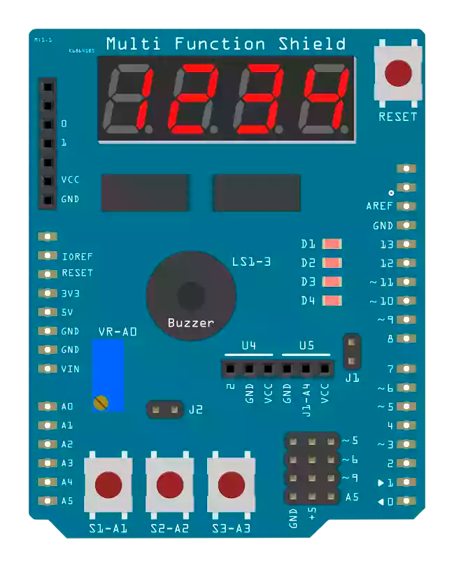

# Multi Function Shield Library

This library was made by Kashif Baig and [Cohesive Computing](https://www.cohesivecomputing.co.uk/hackatronics/arduino-multi-function-shield/).

Here is the most recent version 1.3 with minor improvements by myself:

- Enhanced support for displaying characters (following the modern scheme of [7-segment display character representations](https://en.wikipedia.org/wiki/Seven-segment_display_character_representations))
- Additionl support for some special characters
- Additional support for letter pairs to fit them into one display (e.g., "ii", "li", "il")
- Blink timing updated to maintain approximately 1-second intervals

